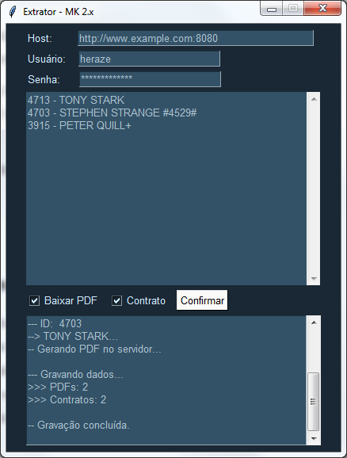

# extractormk
https://github.com/heraze/extractormk/

Aplicativo feito com intuito de automatizar tarefas administrativas como o download de faturas e geração de termos em lote.

Para provedores de internet que utilizem o sistema de gerência MK Solutions versão 2.x, o qual não possui uma API ou fácil acesso ao banco de dados.

